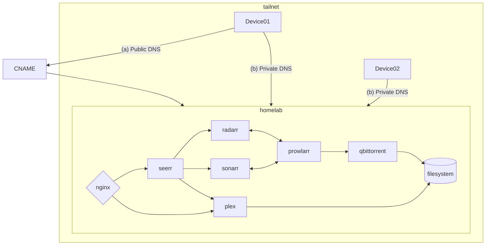

# homelab
## Helpful Commands
### Tail Logs
```
$ tail -f ~/Library/Application\ Support/Radarr/logs/radarr.debug.txt
```
### Test Public DNS
```
$ dig +short tv.alexyoung.io
```
## Architecture

```mermaid
flowchart
    Device01--(a) Public DNS-->CNAME
    CNAME-->homelab
    subgraph tailnet
        subgraph homelab
            nginx{nginx}
            nginx-->seerr
            nginx-->plex
            seerr-->radarr
            seerr-->sonarr
            seerr-->plex
            radarr<-->prowlarr
            sonarr<-->prowlarr
            prowlarr-->qbittorrent
            fs[(filesystem)]
            qbittorrent-->fs
            plex-->fs
        end
        Device01--(b) Private DNS-->homelab
        Device02--(b) Private DNS-->homelab
    end
```
